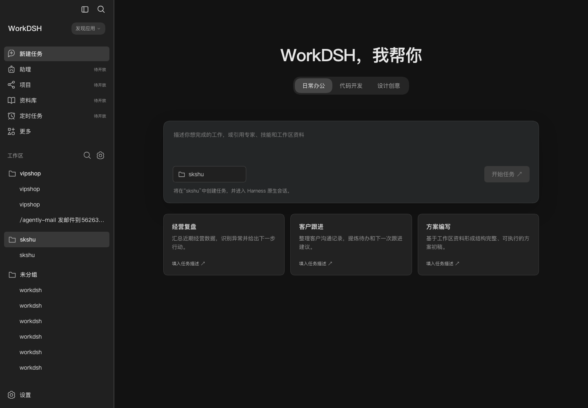

# WorkDSH

**English** | [简体中文](README.zh-CN.md)

A plugin-based Web work platform built on DeepSeek Harness. Experts, skills, connectors, industry applications, and other capabilities are distributed as independent feature plugins. Each plugin manages multiple domain objects and can participate in the same task.

**Current release: `v0.1.0-alpha.1`, the first development preview.** The default/local Skill management workflow is available. Experts, connectors, projects, libraries, and the enterprise server and administration Web application remain planned or deferred.

This preview includes:

- Additive WorkDSH navigation through the official DeepSeek Harness Sidebar Slots while retaining native Workspace, Session, Settings, and Conversation behavior.
- A global Skill list with search, full `SKILL.md` content, resources, and detail views.
- Skill document and resource editing, revision conflict detection, rediscovery, and opening the Skill directory.
- Skill enablement, dependency impact confirmation, batch management, and recoverable uninstall.
- Safe `.zip`, `.md`, and folder import with preflight inspection, explicit confirmation, atomic installation, and failure recovery.
- Skill creation through the native Conversation, `/skill-creator`, and official Harness tools, preserving native `/`, `@`, attachments, permissions, model selection, and send behavior.

## Screenshots

### Skill management


### Native workbench integration



The current product does not provide a public Skill marketplace, SkillHub, or bundles. The enterprise edition is planned as a separate server, administration Web application, and Harness execution nodes. Its boundaries and E01-E05 work packages are recorded in the [enterprise edition architecture note](docs/ENTERPRISE-EDITION.md), [ADR 0015](docs/adr/0015-skill-control-plane-and-runtime-projection.md), and the [deferred ToDo](docs/TODO.md).

## Development

- [Public roadmap](docs/ROADMAP.md)
- [Repository rules](AGENTS.md)
- [Development plan](docs/PLAN.md)
- [Status](docs/STATUS.md)
- [Architecture](docs/ARCHITECTURE.md)
- [Draft public contracts](docs/CONTRACTS.md)
- [Team design](docs/TEAM-DESIGN.md)
- [Enterprise administration design](docs/ADMIN-DESIGN.md)
- [Deferred enterprise edition architecture](docs/ENTERPRISE-EDITION.md)
- [Acceptance matrix](docs/ACCEPTANCE.md)
- [Development environment](docs/DEVELOPMENT.md)
- [Official basis and compatibility evidence](docs/COMPATIBILITY.md)
- [Plugin delivery order and versioning](docs/PLUGIN-DELIVERY.md)

Use Node.js 22.19+ and pnpm 10.34.5:

```bash
corepack pnpm install --frozen-lockfile
corepack pnpm build
corepack pnpm typecheck
corepack pnpm test:integration
corepack pnpm preview
```

Run `corepack pnpm check:plan` to validate planning and module completeness. Full acceptance also includes dependency version checks, integration tests, and the packaged browser installation probe.

This repository does not contain DeepSeek Harness source code. Harness dependencies are pinned to `0.1.5-rc.1`, and Cordis is pinned to `4.0.2`. Development and runtime integration use official documentation and published npm packages only.

## Package layout

Feature plugins live under `packages/plugins/`, including `skills/`, `experts/`, `connectors/`, and `projects/`. The parent directory is only a category; each child plugin is developed and versioned independently. Providers follow the same rule under `packages/providers/`. Shared `bundle/`, `contracts/`, and `ui/` packages live directly under `packages/`. See the [plugin package guide](packages/plugins/README.md).

UI design references: [interaction prototype](docs/ui/index.html) and [visual and interaction specification](docs/UI-DESIGN.md). The prototype describes the intended experience and does not imply that every planned business module is implemented.

## Release scope

The first preview ships these exact module versions:

- `workdsh-plugin-skills@0.1.0-alpha.23`
- `workdsh-plugin-workbench@0.1.0-alpha.8`
- `workdsh-ui@0.1.0-alpha.3`
- `workdsh-bundle@0.1.0-alpha.35`

See the [v0.1.0-alpha.1 release notes](docs/releases/v0.1.0-alpha.1.md) for capabilities, limitations, and validation evidence.
