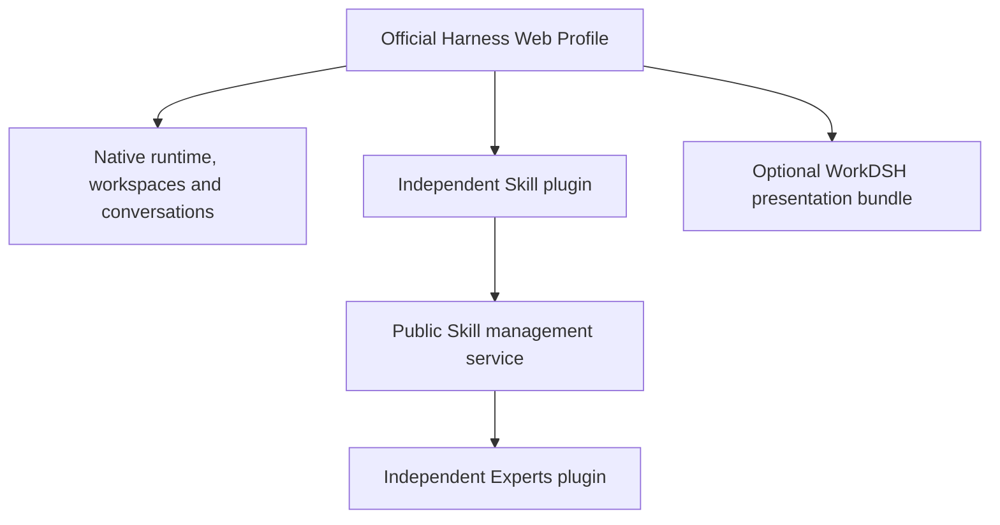

<p align="center"></p>
<h1 align="center">WorkDSH</h1>
<p align="center"><strong>Give AI a job. Watch it work. Open the result.</strong></p>
<p align="center">A plugin-composed AI workspace built on DeepSeek Harness.</p>
<p align="center"><strong>English</strong> · <a href="README.zh-CN.md">简体中文</a></p>
<p align="center">
  <a href="https://github.com/techflag/workdsh/releases">Download</a> ·
  <a href="#quick-start">Quick start</a> ·
  <a href="#see-the-work-not-just-the-answer">Screenshots</a> ·
  <a href="docs/ROADMAP.md">Roadmap</a> ·
  <a href="https://techflag.github.io/workdsh/">Website</a>
</p>

WorkDSH adds **skills, experts, team activity, and editable Office deliverables** to the native DeepSeek Harness task experience. You stay in one conversation while the work appears beside it as a real document, spreadsheet, presentation, PDF, or webpage.


*Real local preview: the conversation, delivered files, and an editable HTML dashboard remain in the same task. Example data and costs belong to the user's test workspace.*

## Start with one real task

Attach your material and ask in plain language:

> Review this budget workbook. Flag every missing assumption, show the findings in a dashboard, and deliver the HTML file.

WorkDSH can keep the source material, model conversation, live result, revisions, and final file together. You can inspect the work, edit it yourself, then ask the AI to continue from the latest saved version.

Already using the Harness `0.1.5-rc.1` Web Profile? Install the modules you need from [Releases](https://github.com/techflag/workdsh/releases), or jump to the [quick start](#quick-start). WorkDSH uses the official `dsh plugin` lifecycle rather than a second runtime.

## What it gives you

| You need | WorkDSH behavior | Result |
| --- | --- | --- |
| A report, brief, or dashboard | Reads the task material, writes in visible batches, and keeps revisions | Editable HTML, Word, PDF, or Markdown working copy within the supported format scope |
| A presentation | Creates or imports a PPTX working copy, edits slides, and keeps human changes | Editable PPTX with download; complex-template fidelity still requires review |
| A spreadsheet | Opens a workbook beside the task and preserves supported values and formulas | Editable XLSX working copy with format-specific limits |
| Repeatable expertise | Installs or creates Markdown skills with resources; experts pin reviewed revisions | Reusable skills and explicit expert identities instead of one-off prompts |
| Team execution | Shows the team, members, active state, and task activity in the conversation | A visible collaboration trail; complete TM-01 real-model acceptance is still in progress |

## See the work, not just the answer

<table>
<tr>
<td width="50%"><br><strong>Live PPT work</strong><br>Review the reasoning and edit slides in the same task.</td>
<td width="50%"><br><strong>Skills as managed capabilities</strong><br>Discover, inspect, install, edit, disable, and recover skills.</td>
</tr>
<tr>
<td colspan="2"><br><strong>Expert teams stay visible</strong><br>The activity bar identifies the team and its current members without replacing the native conversation.</td>
</tr>
</table>

## Why WorkDSH

- **The deliverable stays real.** Supported outputs are saved working copies and downloadable files. A tool failure is not presented as a finished artifact.
- **The workspace stays native.** Harness owns tasks, models, attachments, permissions, queues, skills, and plugin loading. WorkDSH extends those public services and UI slots.
- **Capabilities stay replaceable.** Skills, experts, Office, activity, governance, and presentation are independently versioned modules. Install only the layers your Profile needs.
- **Human edits remain part of the job.** Open a result, correct it, and let the model continue from the saved revision instead of regenerating from an old prompt.

## Current preview status

The latest public Web preview was verified on **Harness `0.1.5-rc.1`, Node.js `22.23.2`, and macOS** through packaged installation and cold-start checks. Skills, individual experts, Office working copies, and collaboration activity are available as alpha modules.

This remains a development preview. Real-model acceptance for complete expert-team workflows, arbitrary Office fidelity, and multi-platform behavior is not finished. The default listener is local; this repository does not claim a production-ready internet-facing multi-tenant deployment. Exact versions, checksums, limits, and evidence are documented below.

## Plugins are the architecture

WorkDSH follows Harness's own extension model: official **Loader + Profile + Cordis**, standard Host/Client entry points, and documented UI Slots. It uses published Harness packages and requires no upstream source checkout.

| Principle | What it means |
| --- | --- |
| Install capabilities independently | Skill ships its own configuration layer, Host service, Client module, and prebuilt `.tgz`. The presentation package is optional. |
| Compose through public contracts | Plugins collaborate through injected services. `workdsh-contracts/skills` exposes the Skill service contract for future consumers such as experts. |
| Keep the native runtime | Harness owns conversations, workspaces, model execution, skill discovery and invocation, and plugin loading. WorkDSH contributes management workflows and UI. |
| Version each module separately | Skill stays on its own `0.1` line. A presentation update does not force a Skill version change. |
| Preserve user content | Removing the Skill **plugin** preserves skill files and management data. Uninstalling an individual **skill** uses the recoverable management workflow. |



A **feature plugin** is an installable software module. A **skill** is a user-managed `SKILL.md` with optional resources. One Skill plugin manages many skills; creating a skill does not require publishing an npm package.

## What Skill 0.1 can do

| Workflow | Available behavior |
| --- | --- |
| Browse | Global local-skill list, search, full `SKILL.md`, resource files, and invalid-skill diagnostics. |
| Create and try | Prepare a native task with `/skill-creator` or `/skill-name`; keep attachments, `/`, `@`, model selection, permissions, and sending. |
| Import | `.zip`, `.md`, or folders; inspect files, validate format and paths, confirm scope, then install atomically. Import does not execute included scripts. |
| Edit | Edit documents and text resources, detect revision conflicts, save, and rediscover. Directory reveal uses the native Host capability. |
| Manage | Enable/disable, check registered dependency impact, batch operations, recoverable uninstall, and restore. |
| Recover | Preserve edits and management state across tested cold restarts; cancel uploads and retry failed imports. |

<details>
<summary><strong>Skill details and standalone installation</strong></summary>


Standalone installation retains Harness branding and native navigation. The optional presentation bundle adds WorkDSH branding and its dark theme.

</details>

## Download by module

Each installable module has a matching **GitHub prerelease, versioned package, SHA-256 checksums, and release manifest**. These are prebuilt artifacts; npm registry publication has not been performed.

| Module | Package version | Download | Scope |
| --- | --- | --- | --- |
| Skill management | `workdsh-plugin-skills@0.1.0-alpha.28` | [Skill `.tgz`](https://github.com/techflag/workdsh/releases/download/skills-v0.1.0-alpha.28/workdsh-plugin-skills-0.1.0-alpha.28.tgz) · [Release](https://github.com/techflag/workdsh/releases/tag/skills-v0.1.0-alpha.28) | Independently installable feature plugin. |
| WorkDSH presentation | `workdsh-bundle@0.1.0-alpha.41` | [Presentation `.tgz`](https://github.com/techflag/workdsh/releases/download/bundle-v0.1.0-alpha.41/workdsh-bundle-0.1.0-alpha.41.tgz) · [Release](https://github.com/techflag/workdsh/releases/tag/bundle-v0.1.0-alpha.41) | Optional brand, theme, and workbench composition. Install Skill separately. |

Workbench `alpha.10` is currently delivered within the presentation bundle. Shared UI `alpha.4`, contracts `alpha.5`, and the local identity/access/audit foundation are development packages, **not standalone end-user plugin downloads in this release**. Other modules remain planned. See the [complete module map](docs/RELEASES.md).

## Quick start

### Install a prebuilt plugin

Use **Node.js 22.19+ on the 22 LTS line, or Node 24+**, **pnpm 10.34.5**, and the official **Harness CLI `0.1.5-rc.1`**. These commands assume `dsh` resolves to that CLI, rather than an older desktop launcher.

Download the Skill `.tgz` above. Create a dedicated Web Profile and replace the example path with your downloaded file's absolute path:

```sh
dsh --profile workdsh --from-default-profile web --dump-config
dsh plugin --profile workdsh add /absolute/path/workdsh-plugin-skills-0.1.0-alpha.28.tgz
dsh --profile workdsh
```

Open **专家 · 技能 · 连接器 → 技能** in the sidebar. Use **添加技能** to import or create a skill, or open a skill and choose **去试试** to prepare a native conversation. Model-backed execution requires your own Harness model configuration.

To add the WorkDSH appearance, stop that Profile, install the optional bundle, then restart:

```sh
dsh plugin --profile workdsh add /absolute/path/workdsh-bundle-0.1.0-alpha.41.tgz
dsh --profile workdsh
```

Follow the official [`dsh plugin … add` flow](https://deepseek-harness.github.io/deepseek-harness/develop/basic/publish). GitHub's **Source code** archives are source snapshots; install the named `.tgz` assets. Installation and removal are verified with the Host stopped and restarted, not as complete live CLI hot-unload operations.

### Run from the repository

```sh
git clone https://github.com/techflag/workdsh.git
cd workdsh
corepack pnpm install --frozen-lockfile
corepack pnpm build
corepack pnpm preview:install
corepack pnpm preview
```

The preview runs at `http://127.0.0.1:18989`; use the authenticated URL printed at startup. It has its own Profile and reads your normal `~/.agents` skills by default. Automated tests use isolated homes. See [development setup](docs/DEVELOPMENT.md).

## Roadmap

| Stage | Scope | Status |
| --- | --- | --- |
| Skill 0.1 | Local skill management and independent package delivery | Available on the verified Web baseline. |
| Experts 0.1 | Definitions, drafts, revisions, shared skill references, and task handoff | Alpha available; professional quality and final stability acceptance incomplete. |
| Following modules | Connectors → library → projects → industry applications → integration | Planned, delivered one module at a time. |
| Enterprise | Server + administration Web + Harness execution nodes; organization skills, categories, versions, access, and rollout | Deferred. No public Skill marketplace, SkillHub, or skill suites in this release. |

See the [roadmap](docs/ROADMAP.md), [expert handoff](docs/design/experts/README.md), and [enterprise ToDo](docs/TODO.md). This preview targets a trusted local user; it is not an internet-facing multi-tenant server.

## Development and documentation

```sh
corepack pnpm typecheck
corepack pnpm test:integration
corepack pnpm test:planning
corepack pnpm check:plan
corepack pnpm check:versions
corepack pnpm probe:skills
corepack pnpm probe:browser
```

Packaged probes exercise actual installation, browser interactions, edits, recovery, removal, and reinstallation. They do not prove real-model quality, enterprise isolation, or compatibility with untested desktop versions.

| Documentation | Purpose |
| --- | --- |
| [Architecture](docs/ARCHITECTURE.md) · [Plugin composition ADR](docs/adr/0018-composable-feature-plugins-and-shared-skills.md) | Ownership, composition, and public plugin boundaries. |
| [Official development rules](docs/HARNESS-OFFICIAL-DEVELOPMENT.md) · [Repository rules](AGENTS.md) | Official contracts first; no parallel runtime or upstream modifications. |
| [Module releases](docs/RELEASES.md) · [Skill package guide](packages/plugins/skills/README.md) | Artifacts, version mapping, installation, and limitations. |
| [Verification evidence](docs/evidence/skills-standalone-package.md) · [Status](docs/STATUS.md) | Actual results and remaining work. |
| [UI specification](docs/UI-DESIGN.md) · [Brand assets](docs/BRAND.md) | Shared components and visual direction. |

Feature modules live in `packages/plugins/<domain>`, providers in `packages/providers/<name>`, and shared packages in `packages/{contracts,ui,bundle}`. Scaffolds do not imply installable plugins. See the [package guide](packages/plugins/README.md).

Built on [DeepSeek Harness](https://deepseek-harness.github.io/deepseek-harness/); interaction references include [WorkBuddy](https://www.workbuddy.cn/). WorkDSH is an independent project, not an official product of either team.

下一阶段开发计划：[PPT 实时制作 → 其他六类（Word 后续暂停）](docs/design/office/NEXT-STAGE.md)。各阶段以真实文件、实时编辑和独立插件生命周期验收，规划不代表能力已完成。

## Current development preview


User-provided screenshot of the current application, showing categories, search, installed-skill management and installation from a local catalog. Third-party skill names and icons belong to their respective providers; they do not demonstrate completed connector integrations. Task names and spending figures are local user state, not bundled defaults.

The current Office development candidate keeps `pptx-react-viewer` as its sole PPT editor, integrated with the native results panel and shared Office content service. It supports incremental slide writing, human editing, native chart data, saved working copies and PPTX download. Chinese UI and design guidance are still being improved; real-model visual quality acceptance is incomplete. This local candidate differs from the published Word-only packages above. See [PPT integration evidence](docs/evidence/office-pptx-integration.md).

### HTML and PDF working copies / HTML 与 PDF 工作副本

The current source candidate can open a self-contained HTML page in the native results panel before AI updates its saved revisions. PDF creation supports Chinese text, page updates, preview, manual text changes and actual PDF download/file delivery. PDF rendering uses bundled libraries and an embedded font; end users do not need Python for this PDF workflow. Existing arbitrary PDF import, OCR and image editing are not supported. These additions are source-development features and do not change the older Word-only release archives.

当前源码候选支持自包含 HTML 先展示、AI 更新保存修订；PDF 支持中文新建、分页更新、预览、人工文字修改及真实文件下载/交付。PDF 流程无需用户安装 Python，不支持已有任意 PDF 导入、OCR 或图片编辑。详情见 [HTML working copies](docs/design/office/HTML-LIVE.md) 与 [PDF working copies](docs/design/office/PDF-LIVE.md)。

#### HTML dashboard generation / HTML 看板生成


Generate a self-contained HTML dashboard from task materials, preview the finished page in the native results panel, and receive the HTML files through native deliverable cards. This user-provided screenshot shows a budget dashboard with parameter cards, section navigation and missing-information notices, alongside the delivered dashboard and `index.html` files. It shows local file preview; conversation names, paths and figures belong to this example.

在对话中根据资料生成自包含 HTML 看板，在右侧成果面板预览成品，并通过原生文件卡片交付。截图展示预算分析看板的参数卡片、章节导航与待确认事项，以及看板 HTML 和 `index.html` 文件交付。用户可保存文件，并自行部署到静态网站托管服务。截图为本地文件预览，其中会话、路径和数字属于该示例。

Public expert creation is reusable across domains, with methods, real Skill selection, explicit UI publication and native task trials. Model-generated content still needs user review; synthetic professional evaluations document limitations rather than guaranteeing every answer. See [current evidence](docs/evidence/d04-experts-review-fixes.md).

公共专家制作按用户需求组织方法、真实技能配备、界面确认发布和原生任务试用。模型成果仍需用户审核；专业样本记录用于说明限制，不代表所有专家每次都能正确回答。

### Native PPT editing preview

[Office alpha.3 source prerelease](https://github.com/techflag/workdsh/releases/tag/office-v0.1.0-alpha.3) · No new installable archive is attached.


User-provided application screenshot showing incremental AI slide editing in the native results panel. This existing conversation still contains earlier export guidance; the new PPTX content_export implementation is described in the source and has not yet passed a real-session file-card acceptance test.

[2026-09-14 发布候选说明](docs/releases/2026-09-14-development-candidate.md) · 最新alpha制品与验证范围见本页顶部。

### Activity and expert teams / 工作动态与专家团


A compact activity strip shows the native task state and the current skill, alongside the original conversation and live HTML working copy. Its colored border animates while processing; animations can be disabled and respect reduced-motion preferences. The strip is centered and uses half the available width on wide screens.

工作动态以紧凑居中的单行展示任务状态和当前技能，保留原生对话、工具调用和右侧 HTML 工作副本。运行时彩色边框循环流动；动画可关闭，并遵守系统减少动态效果设置。


Expert-team sessions carry the team name and activity state. Member activity appears when native child sessions exist; the team label alone does not prove multiple members are executing. This example shows zero child agents at the captured moment.

专家团任务展示团队名称与工作动态；有原生成员子任务时呈现成员状态。截图捕获时为 **0 个子代理**，不能据此宣称多位专家已经并行执行。


Team details show capabilities, starter requests, the lead and members. Saved drafts remain separate from published revisions; summoning uses the published revision until changes are explicitly published. These are user-provided local preview screenshots, including example task names, paths and spending figures; they document the development candidate rather than the older downloadable releases.

专家团详情展示能力、使用示例、主理人和成员。草稿与已发布修订分离，召唤使用已发布版本。这三张用户提供的本地截图用于展示当前开发候选，不代表旧版下载包已包含这些功能，也不代表专家团整体验收完成。

## Open-source components and acknowledgements

Thank you to these projects and their maintainers. This list covers major direct dependencies; package manifests, the lockfile and generated license inventories describe the full dependency set.

| Project | Use in WorkDSH | License |
| --- | --- | --- |
| [DeepSeek Harness](https://github.com/deepseek-ai/deepseek-harness) / Cordis | Native tasks, model execution, skills, Loader, Profile, services and UI extension APIs | MIT |
| [React](https://github.com/facebook/react) | Feature pages and editor UI | MIT |
| [Tiptap](https://github.com/ueberdosis/tiptap) / [ProseMirror](https://github.com/ProseMirror) | Word working-copy editing, tables and images; adapted open-source Tiptap UI components | MIT |
| [pptx-viewer](https://github.com/ChristopherVR/pptx-viewer) | `pptx-react-viewer` 3.16.5 and `pptx-viewer-core` 3.14.3: the sole current PPT editing, parsing and export implementation | Apache-2.0 |
| [docx](https://github.com/dolanmiu/docx) | DOCX generation within the supported scope | MIT |
| [docx-preview](https://github.com/VolodymyrBaydalka/docxjs) | Original-layout DOCX preview | Apache-2.0 |
| [Univer OSS](https://github.com/dream-num/univer) / [ExcelJS](https://github.com/exceljs/exceljs) | Existing experimental spreadsheet adapters in development builds; full online spreadsheets remain planned | Apache-2.0 / MIT |
| [PDF.js](https://github.com/mozilla/pdf.js) | Decode and display generated PDF files with a bundled worker | Apache-2.0 |
| [pdf-lib](https://github.com/Hopding/pdf-lib) / [fontkit](https://github.com/Hopding/fontkit) | Encode PDF working copies and embed Chinese glyphs | MIT |
| [Noto Sans SC](https://github.com/google/fonts/tree/main/ofl/notosanssc) | Bundled static Chinese font; license and derivation metadata retained | SIL Open Font License 1.1 |
| [i18next](https://github.com/i18next/i18next) / [react-i18next](https://github.com/i18next/react-i18next) | Chinese localization for the PPT editor | MIT |
| [Lucide](https://github.com/lucide-icons/lucide) | PPT toolbar icons | ISC |
| [dsh-cost-meter](https://github.com/Han-1413141/dsh-cost-meter) | Separately installed spending plugin in the local preview Profile; not bundled in WorkDSH releases | See the independent project's license |

Special thanks to **WorkBuddy / CodeBuddy** for product experience and skill-design references. Their experiences informed the Skill market layout, grouped toolbars and PPT design guidance. Locally available `tencent-pptx` and `ppt-implement` skills helped us study narrative, palette and layout methods. This acknowledgement does not classify WorkBuddy, its brand assets or skill resources as open source, indicate a Tencent PPT engine integration, or imply an official partnership or endorsement. DeepSeek Harness remains the execution foundation.

Third-party skills and materials retain their providers' terms. Generated archives retain copyright and license texts for dependencies actually bundled; see [Office third-party notices](packages/plugins/office/THIRD-PARTY-NOTICES.md).

### Additional bundled Office dependencies / Office 其他打包依赖

The current build inventory additionally includes the following package versions. Licenses below are the declarations in the installed package metadata. Existing bundled notices are retained.

当前构建另包含下列依赖版本；许可证栏记录安装包元数据的声明，来源链接指向对应项目。完整199项打包依赖见[Office依赖清单](docs/evidence/office-bundled-dependencies-2026-09-14.md)。

下表 10 项是“已声明许可证、但构建未收集到随包文本”的精确报告。此外，`@univerjs/telemetry@0.25.1` 的安装包元数据没有许可证字段，发布清单单独记录为 `dependenciesWithoutDeclaredLicense`。两类缺项均未伪装为许可证收集完成。

| Dependency / 依赖 | Version / 版本 | Declared license / 声明许可证 |
| --- | --- | --- |
| [@ai-sdk/provider-utils](https://github.com/vercel/ai) | 5.0.0 | Apache-2.0 |
| [@ai-sdk/provider-utils](https://github.com/vercel/ai) | 5.0.28 | Apache-2.0 |
| [@nodable/entities](https://github.com/nodable/val-parsers) | 3.0.0 | MIT |
| [@pdf-lib/fontkit](https://github.com/Hopding/fontkit) | 1.1.1 | MIT |
| [franc-min](https://github.com/wooorm/franc/tree/main/packages/franc-min) | 6.2.0 | MIT |
| [ot-json1](https://github.com/josephg/json1) | 1.0.2 | ISC |
| [ot-text-unicode](https://github.com/ottypes/text) | 4.0.0 | ISC |
| [pptx-viewer-mcp](https://github.com/ChristopherVR/pptx-viewer) | 2.5.1 | Apache-2.0 |
| [react-remove-scroll-bar](https://github.com/theKashey/react-remove-scroll-bar) | 2.3.8 | MIT |
| [unicount](https://github.com/josephg/unicount) | 1.1.0 | ISC |

## 2026-09-14 Alpha Web release / 最新预览发行

本批通过8个精确安装包的隔离官方Web Profile安装、两次冷启动、匿名401/认证200、活动插件移除及全部模块移除后冷启动。完整构建、115项集成测试、9项活动测试通过。验证环境：Harness 0.1.5-rc.1，Node 22.23.2，macOS。专家团TM-01、真实长任务状态切换及多平台整体验收尚未完成。

| 模块 | 安装包版本 | 下载 |
| --- | --- | --- |
| experts | `workdsh-plugin-experts@0.1.0-alpha.2` | [Release](https://github.com/techflag/workdsh/releases/tag/experts-v0.1.0-alpha.2) · [tgz](https://github.com/techflag/workdsh/releases/download/experts-v0.1.0-alpha.2/workdsh-plugin-experts-0.1.0-alpha.2.tgz) |
| skills | `workdsh-plugin-skills@0.1.0-alpha.28` | [Release](https://github.com/techflag/workdsh/releases/tag/skills-v0.1.0-alpha.28) · [tgz](https://github.com/techflag/workdsh/releases/download/skills-v0.1.0-alpha.28/workdsh-plugin-skills-0.1.0-alpha.28.tgz) |
| activity | `workdsh-plugin-activity@0.1.0-alpha.1` | [Release](https://github.com/techflag/workdsh/releases/tag/activity-v0.1.0-alpha.1) · [tgz](https://github.com/techflag/workdsh/releases/download/activity-v0.1.0-alpha.1/workdsh-plugin-activity-0.1.0-alpha.1.tgz) |
| office | `workdsh-plugin-office@0.1.0-alpha.4` | [Release](https://github.com/techflag/workdsh/releases/tag/office-v0.1.0-alpha.4) · [tgz](https://github.com/techflag/workdsh/releases/download/office-v0.1.0-alpha.4/workdsh-plugin-office-0.1.0-alpha.4.tgz) |
| bundle | `workdsh-bundle@0.1.0-alpha.41` | [Release](https://github.com/techflag/workdsh/releases/tag/bundle-v0.1.0-alpha.41) · [tgz](https://github.com/techflag/workdsh/releases/download/bundle-v0.1.0-alpha.41/workdsh-bundle-0.1.0-alpha.41.tgz) |

下载所需tgz后，使用官方CLI：`dsh plugin --profile <profile> add /absolute/path/<package>.tgz`。基础身份、审计与授权配套见专家发行附件；各模块独立安装。仅发布GitHub alpha附件，未发布npm注册表。Office依赖引用与声明许可证见下文；现有notice及检查报告保留。
