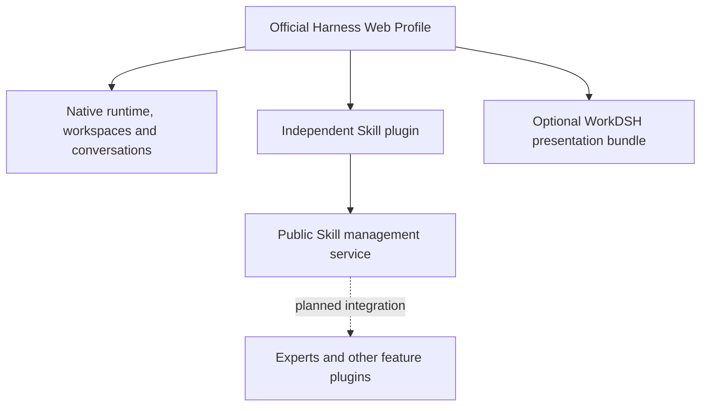

<p align="center"></p>
<h1 align="center">WorkDSH</h1>
<p align="center"><strong>An AI workspace, composed from plugins.</strong></p>
<p align="center">DeepSeek Harness · Native conversations · Independently versioned modules</p>
<p align="center"><strong>English</strong> · <a href="README.zh-CN.md">简体中文</a></p>
<p align="center">
  <a href="https://github.com/techflag/workdsh/releases/tag/skills-v0.1.0-alpha.24">Download Skill plugin</a> ·
  <a href="#quick-start">Quick start</a> ·
  <a href="docs/ROADMAP.md">Roadmap</a> ·
  <a href="docs/RELEASES.md">Module releases</a>
</p>

WorkDSH brings reusable skills and a work-oriented interface to DeepSeek Harness. Install the **Skill management plugin on its own**, or compose it with the optional **WorkDSH presentation bundle** for the branded workspace.

The current **Skill 0.1 development preview** supports local skill discovery, creation, import, editing, enablement, and recovery. Experts, connectors, projects, and enterprise administration are on the roadmap; their design documents and navigation placeholders do not represent completed features.

> **Compatibility:** verified with the official Harness **`0.1.5-rc.1` Web Profile**. Skill alpha.24 has a known missing-navigation issue in DSH Desktop using Harness **`0.1.2-rc.1`**, including after restart. This release **does not fix that issue**. See the [compatibility notes](docs/RELEASES.md).


*Actual packaged application with isolated demonstration skills. Example content is not a bundled public catalog.*

## Plugins are the architecture

WorkDSH follows Harness's own extension model: official **Loader + Profile + Cordis**, standard Host/Client entry points, and documented UI Slots. It uses published Harness packages and requires no upstream source checkout.

| Principle | What it means |
| --- | --- |
| Install capabilities independently | Skill ships its own configuration layer, Host service, Client module, and prebuilt `.tgz`. The presentation package is optional. |
| Compose through public contracts | Plugins collaborate through injected services. `workdsh-contracts/skills` exposes the Skill service contract for future consumers such as experts. |
| Keep the native runtime | Harness owns conversations, workspaces, model execution, skill discovery and invocation, and plugin loading. WorkDSH contributes management workflows and UI. |
| Version each module separately | Skill stays on its own `0.1` line. A presentation update does not force a Skill version change. |
| Preserve user content | Removing the Skill **plugin** preserves skill files and management data. Uninstalling an individual **skill** uses the recoverable management workflow. |



A **feature plugin** is an installable software module. A **skill** is a user-managed `SKILL.md` with optional resources. One Skill plugin manages many skills; creating a skill does not require publishing an npm package.

## What Skill 0.1 can do

| Workflow | Available behavior |
| --- | --- |
| Browse | Global local-skill list, search, full `SKILL.md`, resource files, and invalid-skill diagnostics. |
| Create and try | Prepare a native task with `/skill-creator` or `/skill-name`; keep attachments, `/`, `@`, model selection, permissions, and sending. |
| Import | `.zip`, `.md`, or folders; inspect files, validate format and paths, confirm scope, then install atomically. Import does not execute included scripts. |
| Edit | Edit documents and text resources, detect revision conflicts, save, and rediscover. Directory reveal uses the native Host capability. |
| Manage | Enable/disable, check registered dependency impact, batch operations, recoverable uninstall, and restore. |
| Recover | Preserve edits and management state across tested cold restarts; cancel uploads and retry failed imports. |

<details>
<summary><strong>Skill details and standalone installation</strong></summary>


Standalone installation retains Harness branding and native navigation. The optional presentation bundle adds WorkDSH branding and its dark theme.

</details>

## Download by module

Each installable module has a matching **GitHub prerelease, versioned package, SHA-256 checksums, and release manifest**. These are prebuilt artifacts; npm registry publication has not been performed.

| Module | Package version | Download | Scope |
| --- | --- | --- | --- |
| Skill management | `workdsh-plugin-skills@0.1.0-alpha.24` | [Skill `.tgz`](https://github.com/techflag/workdsh/releases/download/skills-v0.1.0-alpha.24/workdsh-plugin-skills-0.1.0-alpha.24.tgz) · [Release](https://github.com/techflag/workdsh/releases/tag/skills-v0.1.0-alpha.24) | Independently installable feature plugin. |
| WorkDSH presentation | `workdsh-bundle@0.1.0-alpha.39` | [Presentation `.tgz`](https://github.com/techflag/workdsh/releases/download/bundle-v0.1.0-alpha.39/workdsh-bundle-0.1.0-alpha.39.tgz) · [Release](https://github.com/techflag/workdsh/releases/tag/bundle-v0.1.0-alpha.39) | Optional brand, theme, and workbench composition. Install Skill separately. |

Workbench `alpha.10` is currently delivered within the presentation bundle. Shared UI `alpha.4`, contracts `alpha.5`, and the local identity/access/audit foundation are development packages, **not standalone end-user plugin downloads in this release**. Other modules remain planned. See the [complete module map](docs/RELEASES.md).

## Quick start

### Install a prebuilt plugin

Use **Node.js 22.19+ on the 22 LTS line, or Node 24+**, **pnpm 10.34.5**, and the official **Harness CLI `0.1.5-rc.1`**. These commands assume `dsh` resolves to that CLI, rather than an older desktop launcher.

Download the Skill `.tgz` above. Create a dedicated Web Profile and replace the example path with your downloaded file's absolute path:

```sh
dsh --profile workdsh --from-default-profile web --dump-config
dsh plugin --profile workdsh add /absolute/path/workdsh-plugin-skills-0.1.0-alpha.24.tgz
dsh --profile workdsh
```

Open **专家 · 技能 · 连接器 → 技能** in the sidebar. Use **添加技能** to import or create a skill, or open a skill and choose **去试试** to prepare a native conversation. Model-backed execution requires your own Harness model configuration.

To add the WorkDSH appearance, stop that Profile, install the optional bundle, then restart:

```sh
dsh plugin --profile workdsh add /absolute/path/workdsh-bundle-0.1.0-alpha.39.tgz
dsh --profile workdsh
```

Follow the official [`dsh plugin … add` flow](https://deepseek-harness.github.io/deepseek-harness/develop/basic/publish). GitHub's **Source code** archives are source snapshots; install the named `.tgz` assets. Installation and removal are verified with the Host stopped and restarted, not as complete live CLI hot-unload operations.

### Run from the repository

```sh
git clone https://github.com/techflag/workdsh.git
cd workdsh
corepack pnpm install --frozen-lockfile
corepack pnpm build
corepack pnpm preview:install
corepack pnpm preview
```

The preview runs at `http://127.0.0.1:18989`; use the authenticated URL printed at startup. It has its own Profile and reads your normal `~/.agents` skills by default. Automated tests use isolated homes. See [development setup](docs/DEVELOPMENT.md).

## Roadmap

| Stage | Scope | Status |
| --- | --- | --- |
| Skill 0.1 | Local skill management and independent package delivery | Available on the verified Web baseline. |
| Experts 0.1 | Definitions, drafts, revisions, shared skill references, and task handoff | Design handoff prepared; business implementation pending. |
| Following modules | Connectors → library → projects → industry applications → integration | Planned, delivered one module at a time. |
| Enterprise | Server + administration Web + Harness execution nodes; organization skills, categories, versions, access, and rollout | Deferred. No public Skill marketplace, SkillHub, or skill suites in this release. |

See the [roadmap](docs/ROADMAP.md), [expert handoff](docs/design/experts/README.md), and [enterprise ToDo](docs/TODO.md). This preview targets a trusted local user; it is not an internet-facing multi-tenant server.

## Development and documentation

```sh
corepack pnpm typecheck
corepack pnpm test:integration
corepack pnpm test:planning
corepack pnpm check:plan
corepack pnpm check:versions
corepack pnpm probe:skills
corepack pnpm probe:browser
```

Packaged probes exercise actual installation, browser interactions, edits, recovery, removal, and reinstallation. They do not prove real-model quality, enterprise isolation, or compatibility with untested desktop versions.

| Documentation | Purpose |
| --- | --- |
| [Architecture](docs/ARCHITECTURE.md) · [Plugin composition ADR](docs/adr/0018-composable-feature-plugins-and-shared-skills.md) | Ownership, composition, and public plugin boundaries. |
| [Official development rules](docs/HARNESS-OFFICIAL-DEVELOPMENT.md) · [Repository rules](AGENTS.md) | Official contracts first; no parallel runtime or upstream modifications. |
| [Module releases](docs/RELEASES.md) · [Skill package guide](packages/plugins/skills/README.md) | Artifacts, version mapping, installation, and limitations. |
| [Verification evidence](docs/evidence/skills-standalone-package.md) · [Status](docs/STATUS.md) | Actual results and remaining work. |
| [UI specification](docs/UI-DESIGN.md) · [Brand assets](docs/BRAND.md) | Shared components and visual direction. |

Feature modules live in `packages/plugins/<domain>`, providers in `packages/providers/<name>`, and shared packages in `packages/{contracts,ui,bundle}`. Scaffolds do not imply installable plugins. See the [package guide](packages/plugins/README.md).

Built on [DeepSeek Harness](https://deepseek-harness.github.io/deepseek-harness/); interaction references include [WorkBuddy](https://www.workbuddy.cn/). WorkDSH is an independent project, not an official product of either team.
