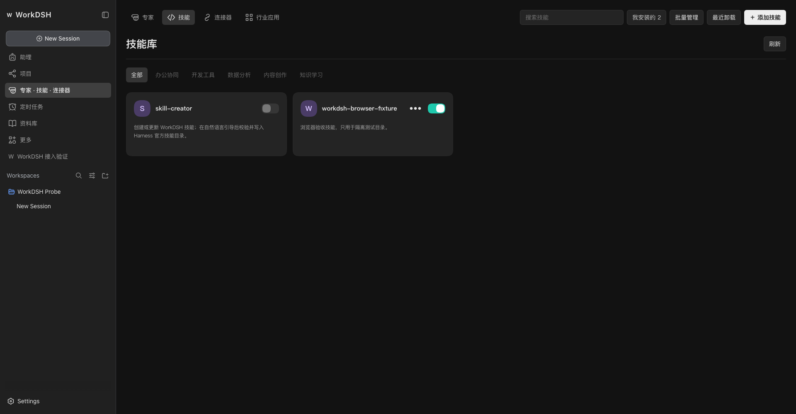
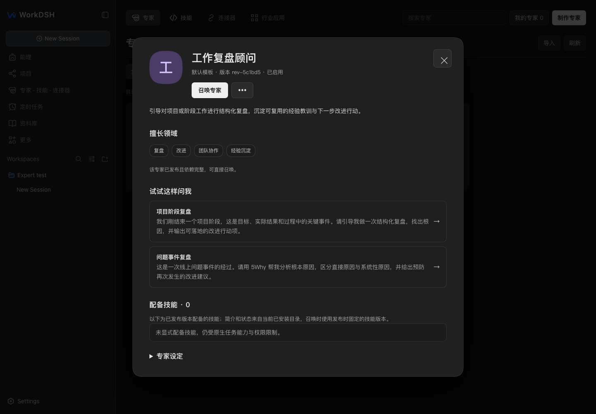
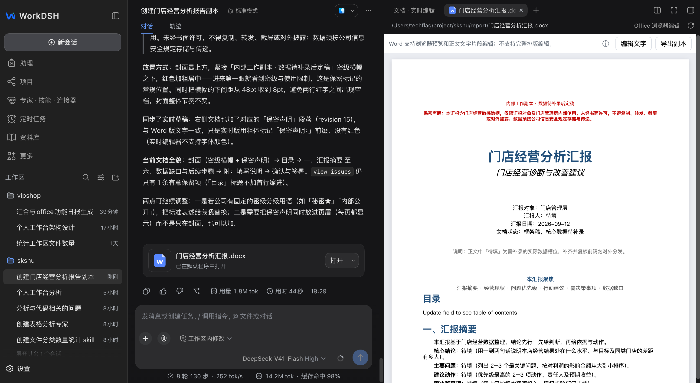
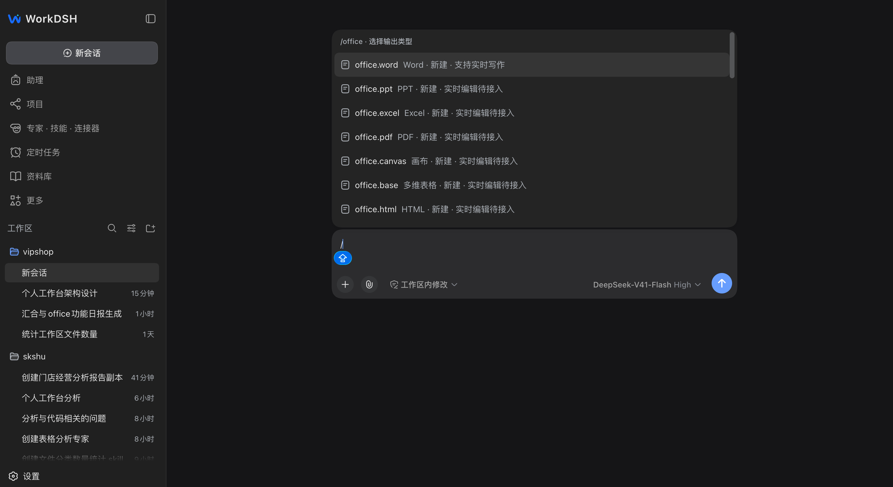
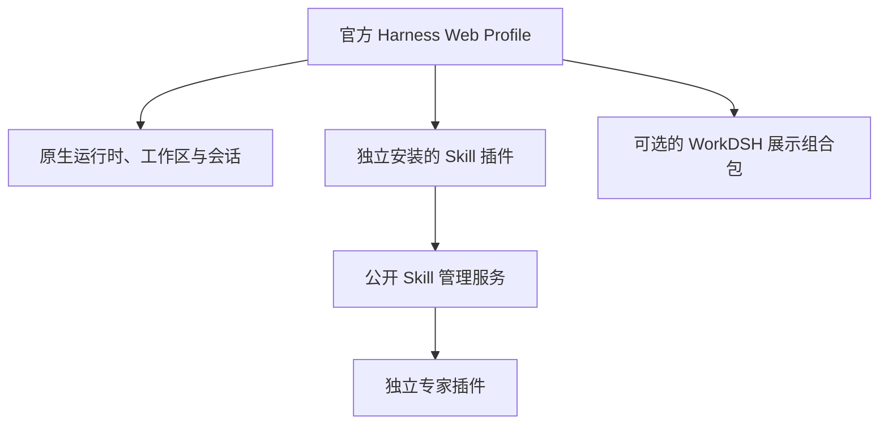
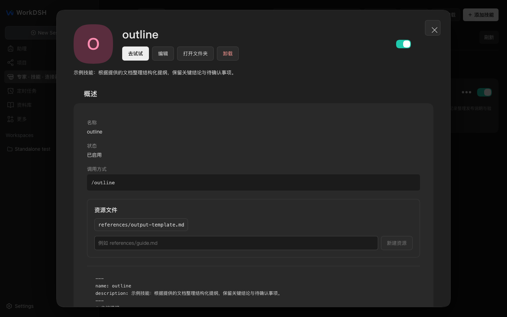
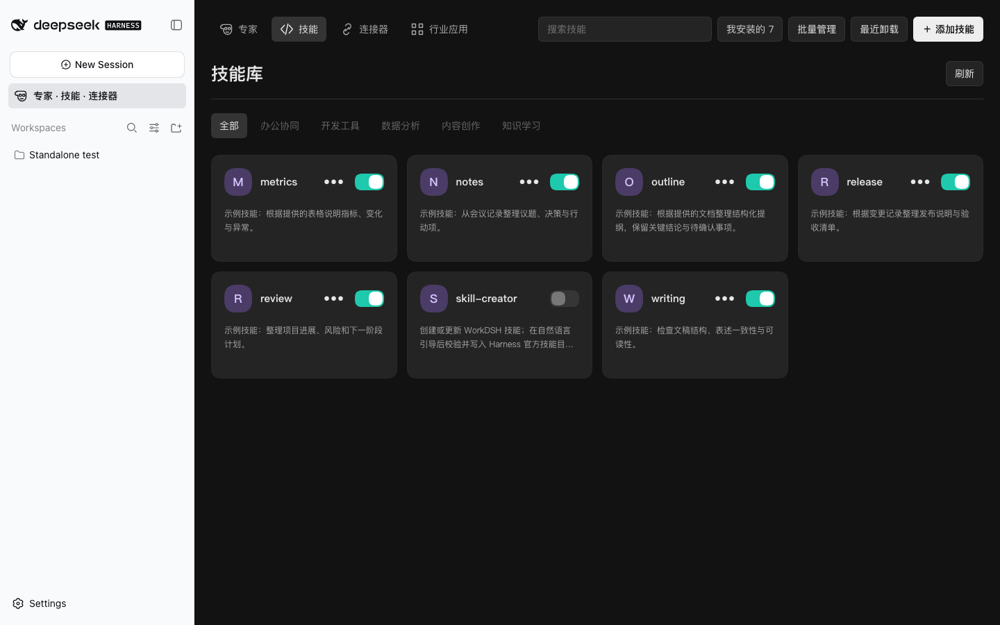

<p align="center"></p>
<h1 align="center">WorkDSH</h1>
<p align="center"><strong>用插件，组合你的 AI 工作平台。</strong></p>
<p align="center">DeepSeek Harness · 原生任务体验 · 模块独立版本化</p>
<p align="center"><a href="README.md">English</a> · <strong>简体中文</strong></p>
<p align="center">
  <a href="https://github.com/techflag/workdsh/releases/tag/skills-v0.1.0-alpha.24">下载技能插件</a> ·
  <a href="#快速开始">快速开始</a> ·
  <a href="docs/ROADMAP.md">开发路线图</a> ·
  <a href="docs/RELEASES.md">模块发布与安装</a>
</p>

WorkDSH 在 DeepSeek Harness 上提供可复用技能与面向工作的界面。你可以**单独安装技能管理插件**，也可以将它与可选的 **WorkDSH 展示组合包**一起使用，获得品牌化工作平台。

当前技能管理与单个专家提供独立预览插件；Office 正在收口 **Word 文本工作副本**。专家团、其余 Office 实时编辑器与企业管理按路线推进，下面区分已实现能力与后续计划。

## 我们的特色

**让 AI 的成果在工作区里逐步成形。** 提出需求后，文档自动在右侧打开；AI 分批写入，你边看边读。你可以接手修改，完成编辑后让 AI 读取最新内容继续完善，最后下载 Word 文件。

| 特色 | 你能获得的体验 |
| --- | --- |
| 写作实时可见 | 每批提交直接出现在右侧文档，无需等整篇完成再打开文件。 |
| 人与 AI 接续编辑 | 在同一份工作副本里修改；人工编辑期间暂停 AI 写入，避免互相覆盖。 |
| 从草稿到文件交付 | 自动保存、重开继续、右侧下载 DOCX；AI 导出后使用 Harness 原生文件产物卡。 |
| 输出类型显式选择 | `/office` 选择输出类型，`@` 指定参考资料或修改对象；新建文档无需引用。 |
| 能力按需组合 | Office 是独立 Host/Client 插件，菜单、工具和编辑入口随插件装配；卸载保留已保存文档。 |
| 保留 Harness 原生体验 | 原生会话、附件、模型、权限与任务队列照常使用；不另造执行器或输入框。 |

**已发布 Word alpha.1 边界：**支持标题、段落、文字样式、列表、查找替换、缩放、跟随阅读和 DOCX 文本副本导入/下载。表格、图片、页眉页脚及完整分页排版尚未进入统一编辑模型，导入时明确提示并保留原文件。八类类型选择已提供，其余七类实时适配待接入。Word alpha.1 提供独立[预览安装包](https://github.com/techflag/workdsh/releases/tag/office-v0.1.0-alpha.1)。

**Word alpha.2：**表格和图片直接复用 MIT Tiptap 扩展，工具栏提供增删行列、合并拆分、列宽拖动、图片插入/缩放/对齐。AI 与页面共享同一文档接口，保存重开及已支持的 DOCX 导入导出保留结构和文字样式。见[范围与限制](packages/plugins/office/README.md)，[下载 alpha.2 预览安装包](https://github.com/techflag/workdsh/releases/tag/office-v0.1.0-alpha.2)。

> **兼容范围：**已验证官方 Harness **`0.1.5-rc.1` Web Profile**。使用 Harness **`0.1.2-rc.1`** 的 DSH Desktop 存在 Skill alpha.24 安装后无导航入口的问题，重启后也可能不显示。**本次发布未修复该问题。**详见[兼容说明](docs/RELEASES.md)。



*正式打包应用的真实截图，使用隔离的演示技能；示例内容不代表随包提供公共技能目录。*


## 单个专家 alpha / Individual Experts alpha

[下载 Experts 0.1.0-alpha.1 / Download](https://github.com/techflag/workdsh/releases/tag/experts-v0.1.0-alpha.1) · [安装说明 / Installation](packages/plugins/experts/README.md)

专家现已作为独立 Harness Host/Client 插件交付：一个插件管理多个专家，专家组合领域经验、专业方法与共享技能。支持对话引导制作、草稿编辑、预览确认发布、固定专家/技能修订，以及原生任务召唤。专家团的多专家＋SOP仍是规划内容。

Experts now ship as an independent Harness Host/Client plugin. One plugin manages multiple experts combining domain experience, methods and shared skills. It supports conversational authoring, drafts, reviewed publication, frozen expert/Skill revisions and native task handoff. Expert teams with SOP remain planned.

**Alpha 边界 / Limits:** 实际模型调用与成果链路已验证，专业报告质量尚未全部验收；请核验业务结论。Requires Harness0.1.5-rc.1 Web and matching companion packages; professional report acceptance is incomplete.




## Office 开发预览



*用户提供的应用截图：右侧 Word 文档预览与原生文件产物卡片。此图不代表完整 Word 排版编辑或所有 Office 编辑器均已完成。*



*在原生任务输入框通过 `/office` 选择输出类型。Word 支持实时写作，其余类型的实时编辑适配仍待接入。*

**版本与打包范围：**历史 alpha.1 提供 Word 文本编辑与 DOCX 原始排版预览；当前 `corepack pnpm release:office:pack` 生成alpha.2 Word 预览包，新增表格及嵌入图片。两者均为 Word-only，打包校验实际依赖许可文本并排除旧 Excel/PPT 实验适配器及依赖。

### 安装与卸载 Office 候选包

以下命令用于本仓库已配置的 `preview` Profile，要求完成开发环境准备，先运行 `corepack pnpm release:office:pack` 生成本地 alpha.2 候选 `.tgz`。已发布的 [alpha.1](https://github.com/techflag/workdsh/releases/tag/office-v0.1.0-alpha.1) 另有下载附件，能力范围以对应版本为准。使用 Node.js 22.23.2。先在运行预览的终端按 `Ctrl+C` 停止应用，再执行安装和启动：

```bash
cd /Users/techflag/project/workdsh

# 安装本地候选包 / Install the local candidate
DSH_HOME="$PWD/.test-runtime/preview" \
  corepack pnpm exec dsh plugin --profile preview add \
  "$PWD/.artifacts/office-release/workdsh-plugin-office-0.1.0-alpha.2.tgz"

# 启动 / Start
corepack pnpm preview
```
卸载也先停止应用，再执行以下命令，随后运行 `corepack pnpm preview` 并刷新页面：

```bash
DSH_HOME="$PWD/.test-runtime/preview" \
  corepack pnpm exec dsh plugin --profile preview remove workdsh-plugin-office
```
请保持安装、卸载和启动使用同一 `DSH_HOME` 与 Profile。卸载撤销 Office 入口及工具，保留已保存文档和原文件；重新安装恢复入口。新建 Word 无需 `@` 引用，在任务输入框选择 `/office` → Word 即可。

## 插件就是架构

WorkDSH 遵循 Harness 自身的扩展方式：官方 **Loader + Profile + Cordis**、标准 Host/Client 入口和公开 UI Slot。工程只使用已发布的 Harness 包，不需要检出上游源码。

| 特色 | 实际含义 |
| --- | --- |
| 按需安装能力 | Skill 自带配置层、Host 服务、Client 模块和预构建 `.tgz`，展示包可选。 |
| 通过公开契约互通 | 插件经服务注入协作。`workdsh-contracts/skills` 提供技能服务契约，专家通过公开契约引用共享技能。 |
| 保留原生运行底座 | 会话、工作区、模型执行、技能发现与调用、插件加载由 Harness 拥有；WorkDSH 补充管理流程和界面。 |
| 每个模块独立版本 | Skill 使用自己的 `0.1` 版本线，展示包更新不强制技能模块同步升级。 |
| 保留用户内容 | 移除技能管理**插件**会保留技能文件和管理数据；卸载某一个**技能对象**则进入可恢复流程。 |



**功能插件**是可安装的软件模块；**技能**是用户管理的 `SKILL.md` 及其资源。一个技能管理插件管理多个技能，制作技能不需要发布 npm 包。

## Skill 0.1 可以做什么

| 流程 | 已有能力 |
| --- | --- |
| 浏览 | 全局本地技能列表、搜索、完整 `SKILL.md`、资源文件，以及无效技能诊断。 |
| 创建与试用 | 将 `/skill-creator` 或 `/技能名` 交给原生任务框，保留附件、`/`、`@`、模型、权限和发送流程。 |
| 导入 | 选择 `.zip`、`.md` 或文件夹；预览文件、校验格式与路径、确认范围，再原子安装。导入不运行包内脚本。 |
| 编辑 | 编辑正文与文本资源、检测修订冲突、保存并重新发现；打开目录使用原生 Host 能力。 |
| 管理 | 启用/停用、检查已登记的依赖影响、批量操作、可恢复卸载和恢复。 |
| 恢复 | 已验证冷重启后保留编辑与管理状态，支持取消上传和失败后重试导入。 |

<details>
<summary><strong>查看技能详情和独立安装效果</strong></summary>





单独安装技能插件时保留 Harness 品牌和原生导航；可选展示组合包提供 WorkDSH 品牌及深色主题。

</details>

## 按模块下载

每个可安装模块对应独立的 **GitHub 预发布、带版本号的安装包、SHA-256 校验文件和发布清单**。这里分发预构建制品，尚未发布到 npm 注册表。

| 模块 | 包版本 | 下载 | 安装范围 |
| --- | --- | --- | --- |
| 技能管理 | `workdsh-plugin-skills@0.1.0-alpha.24` | [技能 `.tgz`](https://github.com/techflag/workdsh/releases/download/skills-v0.1.0-alpha.24/workdsh-plugin-skills-0.1.0-alpha.24.tgz) · [发布页](https://github.com/techflag/workdsh/releases/tag/skills-v0.1.0-alpha.24) | 可独立安装的 Harness 功能插件。 |
| WorkDSH 展示组合 | `workdsh-bundle@0.1.0-alpha.39` | [展示 `.tgz`](https://github.com/techflag/workdsh/releases/download/bundle-v0.1.0-alpha.39/workdsh-bundle-0.1.0-alpha.39.tgz) · [发布页](https://github.com/techflag/workdsh/releases/tag/bundle-v0.1.0-alpha.39) | 可选品牌、主题与工作台组合；Skill 需单独安装。 |

Workbench `alpha.10` 目前随展示包交付。共享 UI `alpha.4`、contracts `alpha.5` 和本地身份/授权/审计基础属于开发包，**本次不作为面向用户的独立插件下载**。其他模块仍在规划中，见[完整模块对应表](docs/RELEASES.md)。

## 快速开始

### 安装预构建插件

使用 **Node.js 22 LTS 的 22.19+ 或 Node 24+**、**pnpm 10.34.5**，以及官方 **Harness CLI `0.1.5-rc.1`**。以下命令要求 `dsh` 指向该版本 CLI，而不是旧桌面应用的启动器。

下载上方技能 `.tgz`，使用独立 Web Profile，将示例路径替换为已下载文件的绝对路径：

```sh
dsh --profile workdsh --from-default-profile web --dump-config
dsh plugin --profile workdsh add /absolute/path/workdsh-plugin-skills-0.1.0-alpha.24.tgz
dsh --profile workdsh
```

在侧栏打开 **专家 · 技能 · 连接器 → 技能**。通过**添加技能**导入或创建，或在技能详情中选择**去试试**，准备原生会话。需要模型执行时，使用你自己的 Harness 模型配置。

需要 WorkDSH 外观时，先停止该 Profile，再安装可选展示包并重启：

```sh
dsh plugin --profile workdsh add /absolute/path/workdsh-bundle-0.1.0-alpha.39.tgz
dsh --profile workdsh
```

安装遵循官方 [`dsh plugin … add` 流程](https://deepseek-harness.github.io/deepseek-harness/develop/basic/publish)。GitHub 的 **Source code** 是源码快照，安装插件请下载对应的 `.tgz`。当前安装与移除验收采用“停止 Host → 修改组合 → 重启”，不声称完成运行中 CLI 热卸载验收。

### 从仓库启动

```sh
git clone https://github.com/techflag/workdsh.git
cd workdsh
corepack pnpm install --frozen-lockfile
corepack pnpm build
corepack pnpm preview:install
corepack pnpm preview
```

预览地址为 `http://127.0.0.1:18989`，请使用启动时输出的认证链接。预览采用独立 Profile，默认读取你的 `~/.agents` 技能；自动化测试使用隔离目录。配置方法见[开发环境说明](docs/DEVELOPMENT.md)。

## 开发路线

| 阶段 | 范围 | 状态 |
| --- | --- | --- |
| Skill 0.1 | 本地技能管理与独立安装交付 | 已在指定 Web 基线上验证。 |
| 专家 0.1 | 专家定义、草稿、修订、共享技能引用和任务交接 | alpha可安装试用；专业成果质量与稳定性验收尚未完成。 |
| 后续模块 | 连接器 → 资料库 → 项目 → 行业应用 → 集成 | 按模块逐一交付。 |
| 企业版 | 服务端 + 管理 Web + Harness 执行节点；组织技能、分类、版本、授权和下发 | 后置。本次没有公共技能市场、SkillHub 或技能套件。 |

[路线图](docs/ROADMAP.md)、[专家交接方案](docs/design/experts/README.md)和[企业版 ToDo](docs/TODO.md)保留范围与验收条件。当前预览面向可信本机用户，不是可直接暴露到公网的多租户服务。

## 开发与文档

```sh
corepack pnpm typecheck
corepack pnpm test:integration
corepack pnpm test:planning
corepack pnpm check:plan
corepack pnpm check:versions
corepack pnpm probe:skills
corepack pnpm probe:browser
```

打包探针实际运行安装、浏览器交互、编辑、恢复、插件移除和重装；不代替真实模型效果、企业隔离或其他桌面版本兼容性验收。

| 文档入口 | 内容 |
| --- | --- |
| [架构](docs/ARCHITECTURE.md) · [插件组合 ADR](docs/adr/0018-composable-feature-plugins-and-shared-skills.md) | 所有权、组合方式和公开插件边界。 |
| [官方开发规范](docs/HARNESS-OFFICIAL-DEVELOPMENT.md) · [仓库规则](AGENTS.md) | 官方契约优先，不另造运行底座、不修改上游。 |
| [模块发布](docs/RELEASES.md) · [Skill 包说明](packages/plugins/skills/README.md) | 制品、版本对应、安装和限制。 |
| [验收证据](docs/evidence/skills-standalone-package.md) · [状态台账](docs/STATUS.md) | 实际通过的检查和未完成事项。 |
| [UI 规范](docs/UI-DESIGN.md) · [品牌资产](docs/BRAND.md) | 共享组件与视觉方向。 |

功能模块位于 `packages/plugins/<domain>`，提供方位于 `packages/providers/<name>`，共享包位于 `packages/{contracts,ui,bundle}`。目录脚手架不等于可安装插件，详见[插件目录说明](packages/plugins/README.md)。

底座采用 [DeepSeek Harness](https://deepseek-harness.github.io/deepseek-harness/)，交互参考包括 [WorkBuddy](https://www.workbuddy.cn/)。WorkDSH 是独立项目，并非上述团队的官方产品。

下一阶段开发计划：[PPT 实时制作 → 其他六类（Word 后续暂停）](docs/design/office/NEXT-STAGE.md)。各阶段以真实文件、实时编辑和独立插件生命周期验收，规划不代表能力已完成。
