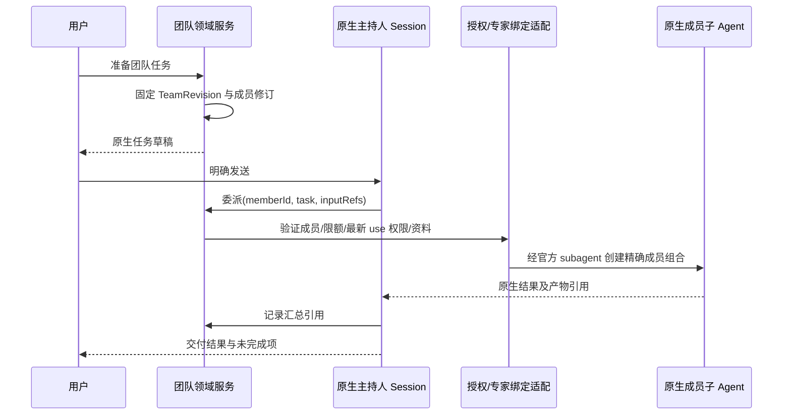

# 专家团技术方案（D11，当前不实施）

本文件完整说明用户参考图中的“专家团”，供后续开发交接。团队属于专家插件的后续功能；不能因为有详情页和成员头像就宣称实现了多代理。当前 D04 发布不会开放团队召唤。

## 1. 产品模型

专家团发布修订固定一组成员、唯一主持人、工作分工、交付汇总规则和资源限制。成员引用已发布的 ExpertRevision，而不是可变的“最新版”别名。专家身份与组织成员身份分开；一个真实用户使用团队不意味着每个虚拟专家都有一个企业账号。

默认软件交付团队可以使用本产品原创角色：交付负责人（主持）、需求分析、架构设计、实现、测试评审。角色描述和示例自有，不使用参考图的人名、头像或案例。至少 2 个成员，建议上限 8；默认并发 3、最大深度 1（当前不允许团队再召唤团队）。这些是建议运行限制，不是 Harness 官方默认值。

| 领域对象 | 数据和约束 |
|---|---|
| ExpertTeam | 稳定 id、owner、origin、availability、draft/published refs；与 Expert 相同治理 |
| TeamRevision | name/description/avatar/tags/examples、members、leadMemberId、mode、coordinationPolicy、limits、digest；发布后不可修改 |
| TeamMember | 稳定 memberId、role、expertRevisionRef、responsibility、inputPolicy、outputContract、required；角色名非身份凭据 |
| TeamRunBinding | runId、teamRevisionRef、parentSessionId、发起 actorRef、workspaceRef、operationId、成员子 Session 映射 |
| DelegationRecord | delegationId、memberId、inputSummaryRef、授权判定 ref、nativeChildRef、attempt、结果/产物引用 |
| TeamSummary | 成功项、失败项、未执行项、冲突项、证据引用；不能编造不存在的成员产物 |

主持人也绑定真实 ExpertRevision。模板发布前验证角色唯一、主持人存在、没有重复 memberId/循环依赖、成员已发布可用、资源限额合法、必需依赖已满足。

## 2. 两种模式的选择

| 模式 | 用途 | 官方依托 | 产品约束 |
|---|---|---|---|
| 自主分工（首个团队版本） | 主持人依据任务动态分配、追问、汇总 | 原生 subagent provider/控制能力 | 委派只能选已声明 memberId；每次有界且经领域授权；记录真实 child ref |
| 固定流程（后续增量） | 明确阶段、输入输出依赖与验收条件 | 官方 workflow + 原生 subagent | 不将任意导入 JavaScript 当安全工作流；业务计划经受信编译/适配；不是自造通用引擎 |
| 实验性 Agent Team | 持续协作、邮箱、共享任务等探索 | 最新文档有说明；当前 lock 未包含 | 默认关闭；需单独兼容性评审、版本升级授权、公开 API 和恢复证据 |

优先交付自主分工的真实闭环；如锁定 subagent provider 不能限制成员能力/身份，不可用简单的 prompt 约定代替强制边界。固定流程不能伪装成首版已有能力。团队插件不直接 `new Worker`/fork 进程来规避官方执行所有权。

## 3. 从召唤到执行

领域委派适配对外只接收 memberId、结构化任务和已授权资料引用；Host 解析该成员对应的 expert/preset。不能允许模型提交任意 preset/npm 配置或 tool allowlist。

默认 fresh 子上下文，输入最少必要任务摘要、产物引用与受权文件。fork 必须作为显式策略验证，避免复制主持人的全部历史。`composeFrom` 决定组合，不代表业务授权；每个子任务必须创建自己的受控绑定，动态重新解析发起主体的最新权限。

每个委派有稳定 delegationId；同一次重试不能重复执行外部操作。实际执行仍由官方 subagent 管理，领域只记录映射/预算/状态引用。跨 Agent 写同一目录时需隔离工作路径或明确串行写阶段；`writeScopes` 是提示，不是文件锁或沙箱隔离证明。

## 4. 状态与恢复

团队 UI 状态是原生事实的投影，不建立另一个权威 Agent 状态机。

| UI 状态 | 判定 | 允许操作 |
|---|---|---|
| preparing | 已有计划、成员尚未激活 | 取消准备 |
| running | 主持人或成员原生 run 活跃 | 看子任务、取消 |
| waiting-user | 原生审批/问题阻塞 | 回答/审批/取消，不能由主持人替用户批准 |
| completed | 必需成员成功，汇总完成，所有已启动成员已终止 | 查看交付、准备新任务 |
| partial | 有可用结果且部分成员失败/被跳过；所有已启动成员已确认终止 | 看失败与结果、明确重试失败项 |
| failed | 无有效交付且运行已结束 | 诊断、准备受控重试 |
| cancelling | 已请求取消，尚未确认全部停止 | 持续跟随原生状态 |
| cancelled | 所有已启动成员都确认停止 | 查看已产生结果 |
| quiescenceUnknown | 断连/超时无法证明某成员停止 | 明确未知，禁止自动重跑有副作用步骤 |

单个成员失败是否继续由 required 与 coordinationPolicy 决定；不能仅用 `Promise.all` 拒绝丢掉其他结果。主持人汇总明确“缺哪个结果”及现有产物来源。可选成员失败即使不阻止交付，也必须在摘要列出。

取消：停止新增委派，调用官方支持的 child cancel/stop，等待有界终止证据，再结束主持人。原生 stop accepted 不等于所有外部命令已终止；超时记 quiescenceUnknown，不能宣称全部取消。具体超时由运行适配配置，默认 30 秒为 UI 等待阈值，不是进程杀死保证。

重启：读取持久 TeamRunBinding 与 Session 事实，再通过公开 provider 查询/恢复。in-process provider 若不能跨重启恢复活跃句柄，展示 interrupted/unavailable 诊断并映射到 quiescenceUnknown；不得按旧进度自动新建同一外部操作。固定流程只可从确认已完成的检查点继续；检查点和幂等能力必须真实实现后才开放按钮。

## 5. 团队治理和编辑

定义发布沿用专家的草稿、校验、确认、不可变修订和幂等操作。成员更新先产生新 TeamRevision，旧 TeamRunBinding 不随之变更。任一必需成员被停用/撤权时，新执行拒绝；活跃任务停止新委派，在下一受控边界重新授权并标明受影响成员。

团队角色不扩大用户权限；每个 Skill、文件、连接器的使用仍有各自授权与 Harness 审批。不能把一个成员的个人连接凭据传播给另一个成员。当前可信本地执行不能宣传为企业跨用户隔离。

默认团队只读可复制。团队创建引导未来使用独立管理入口或 expert-manager 的受控 team 模式，不通过在个人专家提示词里写“你有五名成员”代替结构化 TeamRevision。

## 6. 团队交付包（后续有限范围）

1. TM-01：锁定版 subagent 公开面、身份/组合/取消探针，确定可支持的模式。
2. TM-02：团队 DTO、草稿/发布服务、成员和主持人校验，复用专家修订。
3. TM-03：真实委派与原生事实映射，限制并发/深度，产物汇总。
4. TM-04：详情、成员状态、失败和取消 UI，重启/卸载/权限变化验收。

TM-04 后即完成该团队范围。固定 workflow、实验性 agent-team 和企业分发不是该范围完成的隐性前置；如计划新增，另行批准明确范围。
