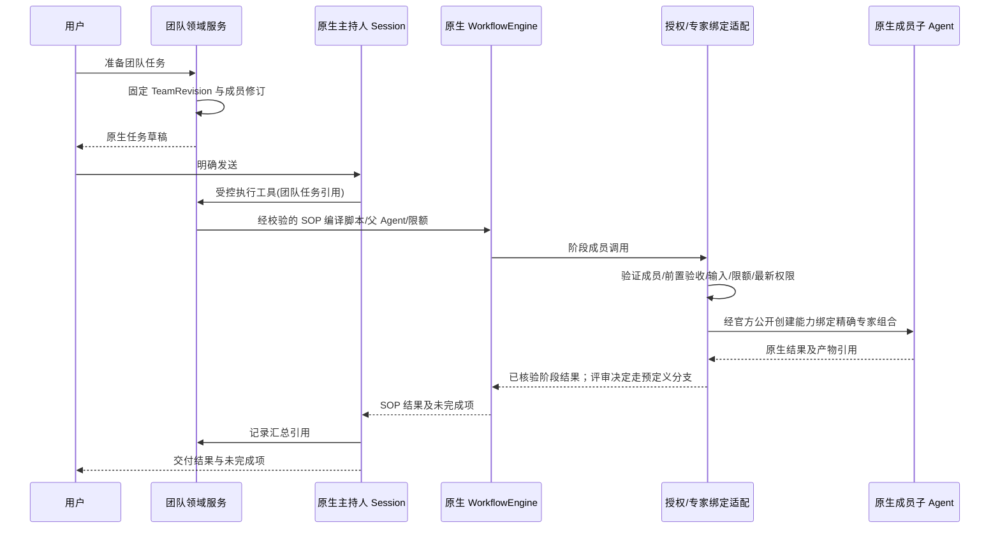
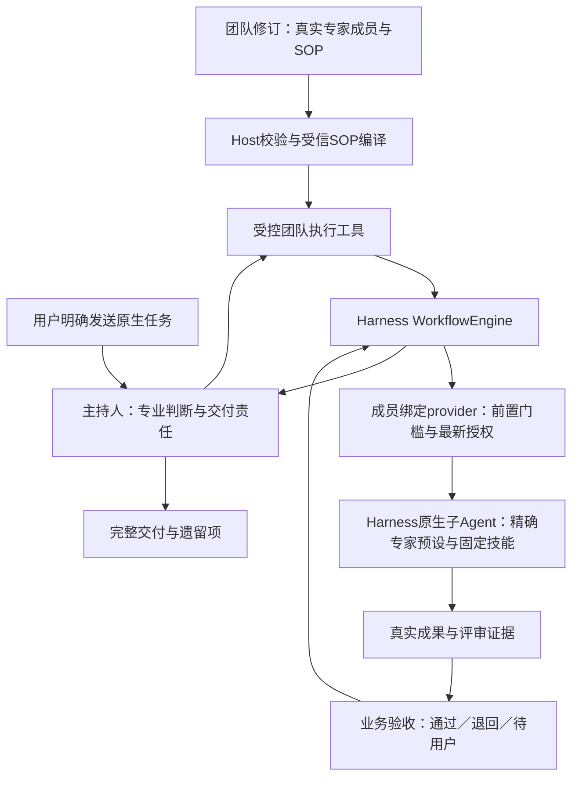

# 专家团技术方案（D11，当前不实施）

基线：PRD-EXPERTS-001 1.1；需求 REQ-TEAM-001～006。

本文件说明用户参考图中的“专家团”，供后续开发交接。团队属于专家插件的后续功能；不能因为有详情页和成员头像就宣称实现了多代理。当前 D04 发布不会开放团队召唤。

## 1. 产品模型

专家团是多位真实专家加 SOP 编排，不是成员头像合集或单模型扮演多个角色。发布修订固定一组成员、唯一主持人、工作分工、SOP 阶段及依赖、输入输出/评审、交付汇总规则和资源限制。成员引用已发布的 ExpertRevision，而不是可变的“最新版”别名。专家身份与组织成员身份分开；一个真实用户使用团队不意味着每个虚拟专家都有一个企业账号。

默认软件交付团队可以使用本产品原创角色：交付负责人（主持）、需求分析、架构设计、实现、测试评审。角色描述和示例自有，不使用参考图的人名、头像或案例。至少 2 个成员，建议上限 8；默认并发 3、最大深度 1（当前不允许团队再召唤团队）。这些是建议运行限制，不是 Harness 官方默认值。

| 领域对象 | 数据和约束 |
|---|---|
| ExpertTeam | 稳定 id、owner、origin、availability、draft/published refs；与 Expert 相同治理 |
| TeamRevision | name/description/avatar/tags/examples、members、leadMemberId、mode、sop、coordinationPolicy、limits、digest；发布后不可修改 |
| TeamMember | 稳定 memberId、role、expertRevisionRef、responsibility、inputPolicy、outputContract、required；角色名非身份凭据 |
| SOPStage（拟定义） | stageId、负责成员、dependsOn、输入/输出要求、并行条件、验收/反馈规则；进入 TeamRevision，具体 wire schema 开发前审定 |
| TeamRunBinding | runId、teamRevisionRef、parentSessionId、发起 actorRef、workspaceRef、operationId、成员子 Session 映射 |
| DelegationRecord | delegationId、memberId、inputSummaryRef、授权判定 ref、nativeChildRef、attempt、结果/产物引用 |
| TeamSummary | 成功项、失败项、未执行项、冲突项、证据引用；不能编造不存在的成员产物 |

主持人也绑定真实 ExpertRevision。模板发布前验证角色唯一、主持人存在、没有重复 memberId/循环依赖、成员已发布可用、资源限额合法、必需依赖已满足。

## 2. 执行方式的选择（2026-09-12修订，提议）

| 模式 | 用途 | 官方依托 | 产品约束 |
|---|---|---|---|
| SOP 内受控分工（首个团队版本） | 固定业务阶段；主持人提供专业判断，流程约束顺序、并行、评审与返工 | 官方 WorkflowEngine + 原生 subagent；受信 SOP 编译与成员绑定适配 | 首版即复用 workflow 执行，不自建调度器；精确专家组合、业务门槛和持久事件适配须通过 TM-01 |
| 通用 workflow 配置（后续增量） | 在首版 SOP 基础上提供更广泛的流程配置与复用 | 官方 workflow + 原生 subagent | 不将任意导入 JavaScript 当安全工作流；业务计划经受信编译/适配；不是自造通用引擎 |
| 实验性 Agent Team | 持续协作、邮箱、共享任务等探索 | 最新文档有说明；当前 lock 未包含 | 默认关闭；需单独兼容性评审、版本升级授权、公开 API 和恢复证据 |

优先交付包含 SOP 阶段与依赖的真实闭环；如锁定 subagent provider 不能限制成员能力/身份，不可用简单的 prompt 约定代替强制边界。首版 SOP 不能省略，但通用流程设计器/任意 workflow 编辑属于后续；当前团队运行未实现，二者都不能写成已有能力。团队插件不直接 `new Worker`/fork 进程来规避官方执行所有权。

## 3. 从召唤到执行

领域委派适配对外只接收 memberId、结构化任务和已授权资料引用；Host 解析该成员对应的 expert/preset。不能允许模型提交任意 preset/npm 配置或 tool allowlist。

默认 fresh 子上下文，输入最少必要任务摘要、产物引用与受权文件。fork 必须作为显式策略验证，避免复制主持人的全部历史。锁定版 `composeFrom(agentCtx, parentCtx)` 继承父 Agent 的同一组合，并不能传专家 id 切换成员身份；指定专家候选路径是在官方 Agent 创建的 setup 中用公开 `agentPresets.mount(agentCtx, presetId)`。原生 spawn 的 start request 没有 preset 字段，不能假定加上 persona 就完成成员精确绑定。具体 provider 适配必须先验证，且组合不代表业务授权；每个子任务必须创建自己的受控绑定，动态重新解析发起主体的最新权限。

每个委派有稳定 delegationId；同一次重试不能重复执行外部操作。实际执行仍由官方 subagent 管理，领域只记录映射/预算/状态引用。跨 Agent 写同一目录时需隔离工作路径或明确串行写阶段；`writeScopes` 是提示，不是文件锁或沙箱隔离证明。

## 4. 状态与恢复

Agent 活跃/停止状态来自原生事实，不建立另一个 Agent 状态机。SOP 的待验收/通过/退回属于必须持久化的业务事实；由领域服务依据真实结果和验收证据写入，不能从 turn/end=completed 自动推出通过。团队 UI 合并两类事实显示。

| UI 状态 | 判定 | 允许操作 |
|---|---|---|
| preparing | 已有计划、成员尚未激活 | 取消准备 |
| running | 主持人或成员原生 run 活跃 | 看子任务、取消 |
| waiting-user | 原生审批/问题阻塞 | 回答/审批/取消，不能由主持人替用户批准 |
| completed | 所有必需阶段验收通过，汇总交付经核验，所有已启动成员已终止 | 查看交付、准备新任务 |
| partial | 有可用结果且部分成员失败/被跳过；所有已启动成员已确认终止 | 看失败与结果、明确重试失败项 |
| failed | 无有效交付且运行已结束 | 诊断、准备受控重试 |
| cancelling | 已请求取消，尚未确认全部停止 | 持续跟随原生状态 |
| cancelled | 所有已启动成员都确认停止 | 查看已产生结果 |
| quiescenceUnknown | 断连/超时无法证明某成员停止 | 明确未知，禁止自动重跑有副作用步骤 |

单个成员失败是否继续由 required 与 coordinationPolicy 决定；不能仅用 `Promise.all` 拒绝丢掉其他结果。主持人汇总明确“缺哪个结果”及现有产物来源。可选成员失败即使不阻止交付，也必须在摘要列出。

取消：停止新增委派，调用官方支持的 child cancel/stop，等待有界终止证据，再结束主持人。原生 stop accepted 不等于所有外部命令已终止；超时记 quiescenceUnknown，不能宣称全部取消。具体超时由运行适配配置，默认 30 秒为 UI 等待阈值，不是进程杀死保证。

重启：读取持久 TeamRunBinding 与 Session 事实，再通过公开 provider 查询/恢复。in-process provider 若不能跨重启恢复活跃句柄，展示 interrupted/unavailable 诊断并映射到 quiescenceUnknown；不得按旧进度自动新建同一外部操作。固定流程只可从确认已完成的检查点继续；检查点和幂等能力必须真实实现后才开放按钮。

## 5. 团队治理和编辑

定义发布沿用专家的草稿、校验、确认、不可变修订和幂等操作。成员更新先产生新 TeamRevision，旧 TeamRunBinding 不随之变更。任一必需成员被停用/撤权时，新执行拒绝；活跃任务停止新委派，在下一受控边界重新授权并标明受影响成员。

团队角色不扩大用户权限；每个 Skill、文件、连接器的使用仍有各自授权与 Harness 审批。不能把一个成员的个人连接凭据传播给另一个成员。当前可信本地执行不能宣传为企业跨用户隔离。

默认团队只读可复制。团队创建引导未来使用独立管理入口或 expert-manager 的受控 team 模式，不通过在个人专家提示词里写“你有五名成员”代替结构化 TeamRevision。

## 6. 团队交付包（后续有限范围）

1. TM-01：锁定版 workflow/subagent 公开面探针：指定专家完整组合、受信阶段调用与越权拒绝、输出门槛、取消/dispose、原生持久呈现事件。先证明链路，不升级、不另造运行器。
2. TM-02：团队 DTO、SOP、草稿/发布服务、成员/主持人/阶段依赖/输入输出校验，复用专家修订。
3. TM-03：SOP 内真实委派与原生事实映射、阶段门槛和并行、输入输出交接/评审反馈，限制并发/深度，产物汇总。
4. TM-04：详情、成员状态、失败和取消 UI，重启/卸载/权限变化验收。

TM-04 后即完成该团队范围。通用 workflow 设计器、实验性 agent-team 和企业分发不是该范围完成的隐性前置；必要 SOP 不在此排除范围；如计划新增，另行批准明确范围。

## 7. 使用与制作旅程补充

使用详情展示专业目标、成员职责及唯一主持人、SOP 概要、真实示例与预期交付，再提供召唤。成员详细经验与技能可查看；技术修订摘要次级呈现。制作团队依次选择目标→已发布成员及职责→主持人→SOP 阶段/先后与并行/输入输出/评审反馈→预览→校验→确认发布；不得仅在专家提示词写“请成立团队”。团队编辑能力 TM-02 实现前不开放假管理入口。

软件交付场景采用原创成员：主持人、需求、架构、实现、测试。需求确认后，架构设计与测试验收设计可并行；实现使用已确认设计，测试发现问题反馈修改；主持人核验产物和遗留问题后汇总。用户批准涉及发布/外部写入时沿用原生审批，不由主持人代理授权。失败、缺输入及冲突要进入可见反馈链，不能凭生成最终摘要标记全部成功。

详细顺序、版本及验收映射见 [开发计划](DEVELOPMENT-PLAN.md)。目前 D11 仍为 todo，所有 SOP DTO 与委派接口为拟设计。

## 8. 落地架构：专家执行工作，SOP约束协作

本节及 [ADR-0020](../../adr/0020-expert-team-sop-on-native-workflow.md) 为架构提议，尚未实现。纠正旧方案把 workflow 主要放到后续通用配置的表达：**首版需要原生 workflow；后置的是通用设计器。**不调整 D04 当前任务、D11 前置 D10 或企业后台后置的计划。

### 8.1 三层职责

| 层次 | 拥有的职责 | 不允许混淆的边界 |
|---|---|---|
| 专家成员 | 领域经验、分析方法、技能、具体成果；发布修订固定 | 成员不是一段临时角色名字；必须确认真实子 Agent 使用该专家完整组合 |
| SOP领域契约 | 哪位成员做哪一步、接受哪些输入、前置验收、并行条件、成果标准、评审与有界返工 | 业务验收不是 Agent loop 的停止原因；不能由主持人一句“已完成”跳过 |
| 原生运行底座 | Workflow执行脚本、子Agent生命周期、模型/工具执行、审批、取消与资源清理 | WorkDSH不复制loop、不自己new Worker、不将UI日志当控制句柄 |

主持人可补充问题、判断质量、提出返工，在声明范围内选择条件分支。改变必需阶段、成员修订、权限或返工上限属于计划变更，须形成可审阅变更并由受信入口确认；不能模型自行改写发布SOP。审批等待应复用已验证的原生机制；跨用户输入的暂停/恢复衔接未验证前，不宣称workflow worker可无期限持久挂起。

### 8.2 SOP首先是业务数据

建议阶段字段：`stageId / memberId / dependsOn / inputRefs / outputContract / acceptance / reviewer / onReject / maxAttempts`。这些是拟议WorkDSH契约，不是Harness原生参数。前向阶段图无环；返工以有界新attempt记录，不能通过删改原结果让失败消失。一个成员可承担多个阶段，每个阶段/attempt有独立原生任务关联，首版不要求常驻群聊或成员互发邮箱。

发布校验覆盖：成员与主持人存在且可用、修订可解析、输入引用来源、无环、必需交付可达、评审角色、有限返工/总调用预算、并行写冲突。不能只校验JSON形状。自然语言制作可以生成该业务草稿；用户预览的是“谁先做、交接什么、如何验收”，任意脚本不成为导入格式。

### 8.3 固定SOP如何驱动原生workflow

Host只把已校验的TeamRevision编译为受信脚本，使用顺序等待、允许的并行与明确的条件/有界循环。执行工具持有真实父Agent，调用公开 `ctx.workflowEngine.start`，明确provider和总Agent限制，在所有完成/错误/取消路径释放run。脚本的 `phase()` 和 `meta.phases` 只是显示注释；**不会自动强制阶段依赖**。前置条件由编译控制流和Host业务门槛共同约束。

脚本调用须映射已授权成员和stage/attempt，Host从任务绑定解析精确预设；不允许任意preset、npm配置、模型路由或工具授权。具体调用封装与一次性调用凭据的传递方式在TM-01确定，普通label或prompt里的角色名不能作为授权依据。成员和主持人的通用委派入口也须检查，避免绕过SOP创建未声明任务。

**公开面核对（锁定0.1.5-rc.1，声明检查完成，运行探针未做）：**

- workflow与worker-thread发布包已在当前依赖中；安装存在不等于目标Profile已激活。公开WorkflowStartRequest提供script/meta/args、真实parent、signal、subagentProvider和maxTotalAgents；不会自动理解TeamRevision。
- SubagentStartRequest提供prompt、parent、signal及有能力条件的persona/toolFilter/outputSchema等，没有指定专家preset字段。`composeFrom`继承父组合；公开`agentPresets.mount`支持在创建setup中挂指定预设。官方in-process driver的公开入口只接受request及可选fork seed，不能凭空传setup/preset覆盖。
- 因此需先验证通过公开provider与Agent创建/句柄能力，能否在首步前挂精确专家组合、写自己的绑定，同时仍使用原生loop与生命周期。若做不到，记录明确缺口；不得复制driver内部实现或用父预设加persona冒充完整专家。
- `workflow/*`为观察事件。官方tool-workflow有自己的持久Session事件和Conversation呈现；自定义调用engine不保证自动获得这套记录。先查可复用公开入口；必要时通过公开Session扩展事件/Conversation注册做领域投影，不复制私有recorder，不凭UI创建假子任务。

### 8.4 验收与返工必须有依据

成员原生completed只说明运行完成。阶段通过至少核验输出格式、实际文件可读及摘要、输入来源，按成果类型核对测试/对账等证据，再接受指定评审决定。模型说“测试通过”必须有真实测试回执；客观检查失败不能被评审一句“通过”覆盖。跨业务通用框架只管理契约与证据，具体专业检查来自该SOP的受信规则，不在底座硬编码某个行业。

保存`stageId/attempt/inputDigests/outputRefs/nativeChildRef/acceptanceDecision/evidenceRefs`。退回不覆盖前次结果；重做改变输入摘要时，受影响的下游阶段不能沿用旧通过状态。是否允许重试须检查最新权限、原生终止与副作用回执；确认不了外部写入结果时先标明未知。首版不承诺跨重启自动续跑脚本；恢复先诊断，再显式准备经验证可重做的阶段。

### 8.5 软件交付团的真实例子

1. 需求专家输出需求与验收条目；缺核心输入则请求用户补充，不启动后续必需工作。
2. 需求验收后，架构专家与测试专家并行产出架构方案和测试设计，二者使用同一需求版本。
3. 实现专家取得已验收设计和测试标准后开发；实现产物有真实文件/修订引用。
4. 测试专家执行并提交失败/通过证据。失败进入有限实现返工，再测试，耗尽上限明确未通过。
5. 主持人依据所有必需阶段的验收、真实成果和遗留项完成交付；不能靠最后一份摘要宣称整体成功。

并行仅在输入和写入范围可兼容时开放。原生child请求默认cwd来自parent；不同输出路径不等于已实现不同工作区/文件锁。隔离配置尚未验证时共享写操作串行，允许只读设计阶段并行。并发、最大尝试、总子Agent调用和深度均须有限；企业分布式调度、Web后台和组织发布仍留后期，不为首版引入服务器。

### 8.6 首版验收终点与需求覆盖

| 需求 | 必须看到的证据 |
|---|---|
| 专家身份真实 | 两个不同发布专家的真实子Session，各自preset/专业设定/固定Skill不串扰 |
| SOP顺序与交接 | 前置未通过不能启动；下游读取正确版本成果；跳步骤请求明确拒绝 |
| 并行与冲突 | 允许阶段确有重叠运行；共享写冲突被串行或已验证的隔离策略拒绝 |
| 评审与返工 | 一次真实不通过→重做→再验收；失败attempt保留；超限停止 |
| 完整交付 | 必需阶段和真实成果全部核验；部分失败/未执行明确展示 |
| 治理与恢复 | 取消清理、撤权阻断、重复调用、插件服务消失和重启未知状态不造成自动重复写 |

继续沿用TM-01～04四个交付包，不增加隐藏阶段。TM-01先证明官方链路可行；TM-02固定定义/发布；TM-03实现一个完整SOP；TM-04完成界面与失败恢复。当前仅更新方案，没有团队运行代码或验收结果。

官方依据：[Workflow](https://deepseek-harness.github.io/deepseek-harness/reference/subsystems/workflow)、[Subagent](https://deepseek-harness.github.io/deepseek-harness/reference/subsystems/subagent)；本地镜像见docs/deepseek-harness-docs/subsystems/workflow.zh.md与subagent.zh.md。网页、锁定发布声明与未来真实运行证据分开记录。

## 9. 官方子系统复核补充：subagent不能省略（2026-09-12）

本轮按用户指定目录进一步阅读README、subagent、workflow、agent-team、core、session-projection、conversation、session-reference、skills与approval的相关契约；同时对照锁定发布包的公开SubagentRuntime声明。下面是对第8节提议的补充，不是实现证据。

### 9.1 复用路线应按协作类型区分

| 场景 | 优先评估的官方能力 | 需补的领域差异 |
|---|---|---|
| 固定SOP、有限阶段调用 | workflow + one-shot subagent | 团队修订、精确专家绑定、成果交接与业务验收 |
| 同一专家多轮讨论/反馈 | continuable subagent，原生inbox/sendMessage及激活管理 | 确认该路径可保持精确专家组合；关联消息与业务阶段验收 |
| 成员间直接交流、共享任务板 | 实验性Agent Teams：roster、peer mailbox、task blockers | 固定发布成员与专业组合、SOP质量门槛；先核对锁定版本可安装性与兼容性 |

**固定SOP先用one-shot是范围选择，不表示Harness只能一次性委派。**返工如果需要保持同一成员上下文，应评估continuable，不能直接新造“常驻专家管理器”。Agent Teams已有任务依赖和邮箱，不能把这些当作Harness完全缺失的能力而自行开发另一套通用团队底座。当前lock未检出agent-team包，故不直接作为首版已激活能力，也不擅自升级；这是版本/装配限制，不是认定其思路不适合专家团。

### 9.2 已有能力与约束

- 锁定公开SubagentRuntime已有startContinuable、sendMessage、interrupt、listChildren与listDescendants。可继续子Agent持久Session与进程内Activation分开；原生管理器拥有物化、冷恢复、唯一inbox、父子所有权和释放。不能另做消息队列、Activation registry或轮次循环。
- one-shot的SubagentRun只拥有本次结果与dispose，没有sendMessage/恢复。continuable不通过SubagentRun管理多轮对话，不能把两种句柄强行包装为一套假运行语义。
- sendMessage准入成功只表示消息被接纳，不表示轮次结束或成果合格；准入后的调用方signal取消不会自动取消已接纳工作。interrupt只中断当前活动并保留队列，不自动dispose整个成员及其后代。团队整体停止须复用相应所有者清理契约并核验，不把interrupt返回当“团队全部停止”。
- 普通subagent模型消息只支持直接父子，不支持sibling直接交流。需要peer消息时先评估官方Agent Teams mailbox，或者保持首版经主持人交接，不编造原生sendMessage可任意群聊。
- listChildren/listDescendants是官方发现入口，不会为了列表唤醒子Agent。inactive/running不是阶段验收结果，也不证明可恢复性；团队页面应复用官方事实并叠加自己业务验收，不再扫描目录构建另一套子任务目录。
- continuable的prepareContinuable只贡献可选历史seed，**不能通过自定义provider在这里偷偷插入preset/setup创建逻辑**。精确专家绑定必须分别证明one-shot和continuable路径；前者可扩展不代表后者也能同样扩展。冷恢复子Session能力也不代表恢复workflow脚本程序位置或自动重做外部操作。

### 9.3 对适配层的进一步收敛

第8节的“成员绑定provider”是候选公开扩展，不能先假定必须新建。TM-01先验证官方现有consumer/provider配置与创建挂载机制能否直接满足目标，只有确实缺业务差异才增加最小适配。persona是官方有作用域的专业提示机制，适用于其真实支持范围；问题在于它本身不保证另一个完整专家preset及固定Skill组合，不能仅因用了persona就否认真实Agent，也不能据此冒充完整专家绑定。

团队阶段状态优先由Host通过官方sessionProjections注册纯折叠单元；框架驱动与传送完整快照，Client只渲染，不另开日志流或在浏览器重算权威状态。Conversation扩展走官方Event/View Definition。业务定义/修订复用Storage域；资料引用先核对官方SessionReference/FileReference能力，但显示label和引用本身均不授予访问权。Skill按原生Host/scope目录和发布固定依赖适配读取，不给每位成员复制一套技能管理器。人工许可继续复用approval，专业主持人不能代理用户权限。

### 9.4 TM-01补充交付要求

保留原四包计划，只细化TM-01，不新增产品阶段：

1. 出具one-shot、continuable、实验性Agent Teams三条路线的锁定版本exports/类型/装配矩阵；明确哪些已可直接复用、哪些未安装、哪些存在业务缺口。
2. 验证两个不同专家的专业设定/固定技能与任务绑定，在首次运行和可支持的恢复入口均一致；分别验证continuable是否能满足精确组合，不从one-shot结果推断。
3. 验证父子消息准入与结束区别、冷列表不唤醒、interrupt与整体清理区别、取消副作用未知状态；复用原生事实和Session projection。
4. 得出有限推荐及失败依据，再决定是否需要最小公开适配。未通过前不提交自建团队调度器、消息系统或通用Agent管理服务。

官方链接：[Subagent](https://deepseek-harness.github.io/deepseek-harness/reference/subsystems/subagent)；本地对照目录为docs/deepseek-harness-docs/subsystems。实验性Agent Teams的可用性须另做包版本核对，本轮仅阅读文档及检查当前lock，没有安装、升级或执行真实团队探针。
